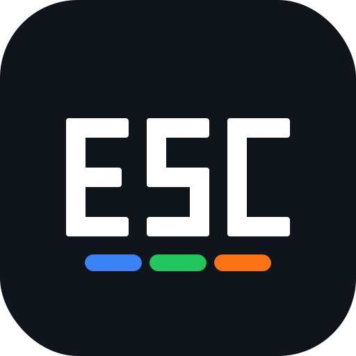

<p align="center">
  
</p>

# enderslicercura

enderslicercura is an Android-first CuraEngine front end designed for practical slicing directly on a phone or foldable. It currently targets a modified Creality Ender 3 V2, while exposing editable printer dimensions, nozzle and filament data, start/end G-code, print settings, supports, travel, cooling, adhesion, model placement, and displacement-texture editing through an embedded BumpMesh workspace.

The app is capable of importing an STL, importing Cura configuration data, adding printable surface textures, slicing with the bundled ARM64 CuraEngine, previewing the generated layers, estimating print time, and exporting printer-compatible G-code.

Android application ID: `com.tomppi.enderslicercura`.

## Project status

enderslicercura is working and is already producing output very close to Cura Desktop for the current reference printer/profile. It is not yet being described as a complete Cura replacement: several more side-by-side slicing comparisons using different model shapes, support cases, infill patterns, model transforms, textured meshes, and profile combinations are still required before parity can be considered broadly validated.

The current development line is `0.7.0-dev` and uses CuraEngine `5.11.0-beta.1` with matching Cura resources. BumpMesh is pinned to upstream commit `a6ac179149b8a17c71a9469dd4cb6f866c0c01d1`.

## Current capabilities

- Native Android and Jetpack Compose interface
- Foldable-friendly wide and compact layouts
- Bundled ARM64 CuraEngine with adaptive use of up to eight workers
- Binary and ASCII STL import
- CuraEngine adaptive layer-height controls with fine, balanced and fast presets
- Layer timeline with pauses, filament changes, temperatures, fan, speed, flow, retraction, camera, messages and guarded custom G-code
- Built-in temperature, flow, speed, fan and firmware-retraction calibration towers
- Non-destructive layer-event editing without re-slicing
- High-contrast current-layer ribbon preview with optional dimmed build-up context
- Layer-height range display and timeline event markers
- Offline BumpMesh displacement-texture workspace
- BumpMesh preset textures and custom image maps
- Planar, cubic/triplanar, cylindrical and other BumpMesh mapping controls
- Surface and angle masking, subdivision, displacement and decimation
- Textured STL return directly into the slicer workflow
- Cura `.3mf` project configuration import
- Cura `.curaprofile` import
- Full machine/extruder definition inheritance and formula recalculation
- Imported settings as a persistent baseline with explicit app overrides
- Editable categorized print settings
- Editable printer definition and custom start/end G-code
- Model centering, movement, rotation, drop-to-bed and lay-flat controls
- Cura project scene-transform support for a separately imported STL
- Tree and normal support settings, support interfaces and support preview
- OpenGL model viewer with unrestricted orbit, zoom and pan
- Cumulative layer preview colored by commanded print speed
- Support and support-interface highlighting in the layer viewer
- Full-height sampled previews for very large G-code files
- Cura estimated print time display
- G-code validation, temperature safety checks and repaired metadata
- CRLF printer-compatible G-code export
- Unique export names that always end in `.gcode`
- Persistent configuration and app-setting restoration
- GitHub Actions APK and CuraEngine build pipeline

## BumpMesh texturing

Import and position an STL, then open **Menu → Texture model (BumpMesh)**. The app stages the currently displayed mesh as a temporary binary STL and opens the bundled BumpMesh interface. Choose a preset or custom height map, adjust mapping, amplitude, masking, output resolution and triangle count, then use **Export STL**.

The Android bridge captures that binary STL locally, validates its exact triangle count and file length, and returns it to the normal enderslicercura model-import path. No model or texture is uploaded to a server. The embedded workspace uses packaged copies of BumpMesh, Three.js, fflate and meshStep rather than the live BumpMesh website or CDN modules.

The Android integration caps BumpMesh output at 1,500,000 triangles, matching the current STL parser limit. Very fine texture settings can still consume substantial memory and processing time on a phone.

## Adaptive layers, layer events and calibration

Adaptive layer height uses CuraEngine's native `adaptive_layer_height_*` settings. Enable it under **Print settings → Quality**, then tune the total variation, variation step and surface-detail threshold or select a preset. The layer viewer reports the actual minimum and maximum layer heights found in the generated G-code.

After slicing, select any layer and open **Add event**. Events are inserted immediately after Cura's layer marker and are rebuilt from an untouched base G-code file, so adding or removing a pause, filament change, temperature, fan, speed, flow, firmware-retraction, camera, display-message or guarded custom-G-code event does not run CuraEngine again. Unsafe custom commands such as homing, emergency stop, EEPROM writes and motor release are blocked inside layer events.

Open **Menu → Calibration generator** to create a stepped temperature, flow, speed-factor, fan or firmware-retraction tower. Each generated STL includes visible section markers and schedules the matching G-code value changes automatically when sliced. Retraction towers enable firmware retraction and change `M207` distance while retaining the configured retraction speed.

The layer viewer defaults to a high-contrast **Current** mode that renders the selected layer as wide colored ribbons with a dark outline. **Build-up** mode adds earlier layers at low opacity. Cyan identifies support, magenta identifies support interface, orange identifies adhesion, and normal model paths remain colored by print speed.

## Reference printer

The built-in baseline describes the currently tested machine:

- Modified Creality Ender 3 V2
- 230 × 230 × 250 mm build volume
- 0.4 mm nozzle
- 1.75 mm filament
- Marlin G-code
- Direct-drive extruder
- Dual-Z drive
- Z probe using UBL mesh slot 0
- Heated bed
- User-editable start and end G-code

The app can edit these machine values, but the most complete real-printer validation has been performed against this configuration.

## Cura comparison

The following comparison used the same STL and the same Cura `5.11.0-beta.1` project/profile data in Cura Desktop and enderslicercura.

### Overall result

| Metric | enderslicercura | Cura Desktop | Difference |
|---|---:|---:|---:|
| Layers | 115 | 115 | Exact |
| Layer height | 0.20 mm | 0.20 mm | Exact |
| Initial layer height | 0.28 mm | 0.28 mm | Exact |
| X bounds | 65.213–164.783 mm | 65.213–164.783 mm | Exact |
| Y bounds | 65.213–164.783 mm | 65.213–164.783 mm | Exact |
| Printed Z bounds | 0.28–23.08 mm | 0.28–23.08 mm | Exact |
| Filament metadata | 2535.9 mm | 2536.3 mm | −0.4 mm (−0.0158%) |
| Extruding XY path | 73061.74 mm | 73074.24 mm | −12.50 mm (−0.0171%) |
| Travel XY path | 76720.01 mm | 80292.77 mm | −3572.75 mm (−4.45%) |
| Estimated time | 4806.07 s | 4883.65 s | −77.58 s (−1.59%) |
| Firmware retracts (`G10`) | 1352 | 1352 | Exact |
| Firmware unretracts (`G11`) | 1351 | 1351 | Exact |

The larger travel/time difference is concentrated mainly in early-layer skin travel. The printed geometry and extrusion destinations remain extremely close; Cura Desktop takes several long segmented combing detours that enderslicercura avoids. More models are needed to determine how often this path-ordering difference appears.

### Feature extrusion

| Feature | enderslicercura | Cura Desktop | Difference |
|---|---:|---:|---:|
| Inner walls | 469.29038 mm | 469.29721 mm | −0.00683 mm (−0.00146%) |
| Outer walls | 621.63546 mm | 621.63765 mm | −0.00219 mm (−0.00035%) |
| Skin | 1352.49266 mm | 1352.58103 mm | −0.08837 mm (−0.00653%) |
| Infill | 29.26724 mm | 29.51388 mm | −0.24664 mm (−0.83567%) |
| Support | 47.90181 mm | 47.92595 mm | −0.02414 mm (−0.05037%) |
| Support interface | 8.32455 mm | 8.35116 mm | −0.02661 mm (−0.31864%) |

The two files also contained identical counts of wall, skin, infill, support, support-interface and skirt sections. This is a strong parity result for one reference model, not proof that every Cura setting and geometry case is already identical.

## Remaining validation and limitations

The next validation work should compare additional Cura and enderslicercura outputs covering:

- Large and small models
- Models with many disconnected islands
- Tree and normal supports
- Dense support interfaces
- Different infill patterns and densities
- Brims, skirts and other adhesion modes
- Rotated and translated models
- BumpMesh textures on flat, curved, thin and overhanging surfaces
- Overhangs, bridges and thin walls
- Long prints that exceed the full-resolution preview memory cap
- Multiple Cura profiles and material definitions

Current functional limitations include single-model and single-extruder slicing. Layer events currently target Marlin-compatible commands; verify firmware support for commands such as `M600`, `M240`, `M207`, `M220` and `M221` before printing. Duplicate/auto-arrange workflows and full Cura plugin compatibility are not implemented. The first BumpMesh integration returns the textured STL through the normal import path, so unusual manual XY placement should be checked after texturing before slicing.

## Large layer previews

The exported G-code is never shortened by the preview system. For very large files, the viewer retains up to 800,000 representative extrusion paths distributed across the complete print. All layers and the full printed height remain available in the slider even when the preview is marked as capped.

## Build

Requirements:

- JDK 17
- Android SDK platform 36
- Android NDK `28.2.13676358`
- CMake `3.22.1` for the Android project
- CMake `3.31.6` for the CuraEngine cross-build pipeline
- Gradle `9.4.1`
- ARM64 Android device (`arm64-v8a`)
- Network access on the first clean build to fetch pinned Cura and BumpMesh sources

Build the Android app with:

```bash
gradle :app:assembleDebug
```

The app Gradle project automatically prepares the pinned BumpMesh workspace before `preBuild`. Generated BumpMesh assets are stored under `app/src/main/assets/bumpmesh/`, ignored by Git, and reused while the source marker remains unchanged.

GitHub Actions builds CuraEngine, prepares the offline BumpMesh workspace, runs the unit/regression tests, packages the debug APK and uploads the build artifacts.

## CuraEngine

The repository pins CuraEngine and Cura resource data to `5.11.0-beta.1` so imported projects and the Android engine use matching setting definitions. The Android build scripts include the project-specific resolved-settings, model-transform and safety integration required by enderslicercura.

## Safety

Generated G-code is validated before export. The validator checks active nozzle targets during extrusion, repairs key metadata, uses CRLF line endings and produces filenames where `.gcode` is always the final extension.

BumpMesh output is accepted only when it is a valid binary STL whose header triangle count exactly matches its file length and remains within the 1,500,000-triangle Android limit.

Always inspect settings, machine dimensions, model placement, textured geometry and custom start/end G-code before printing. This remains development software and has not yet been validated across the full range of Cura-supported printers and profiles.

## License

enderslicercura is intended to be distributed under GNU AGPL-3.0-or-later because it links to CuraEngine, which is AGPL-licensed. The embedded BumpMesh source is retained under `AGPL-3.0-only`. See `THIRD_PARTY_NOTICES.md` and the license files included in the generated BumpMesh workspace for dependency details.

UltiMaker and Cura are trademarks of their respective owners. enderslicercura is not an official UltiMaker, Creality or CNC Kitchen application.
