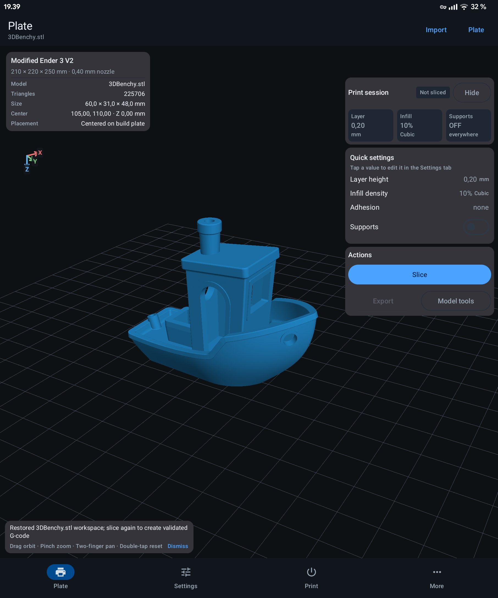
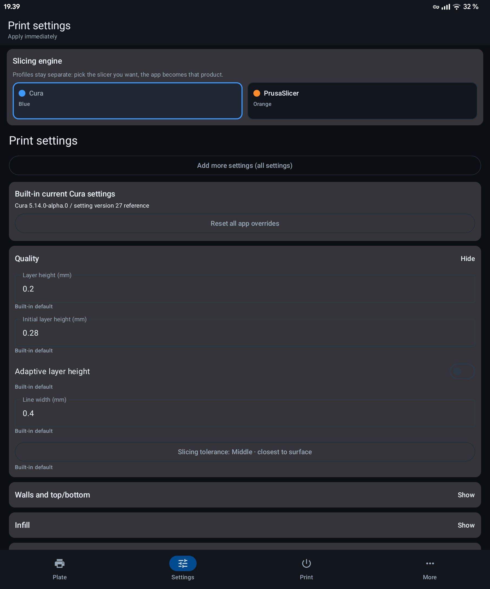
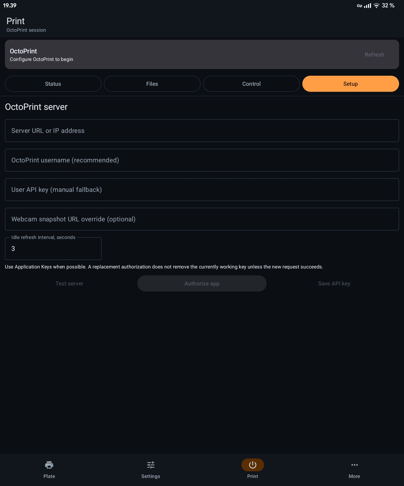
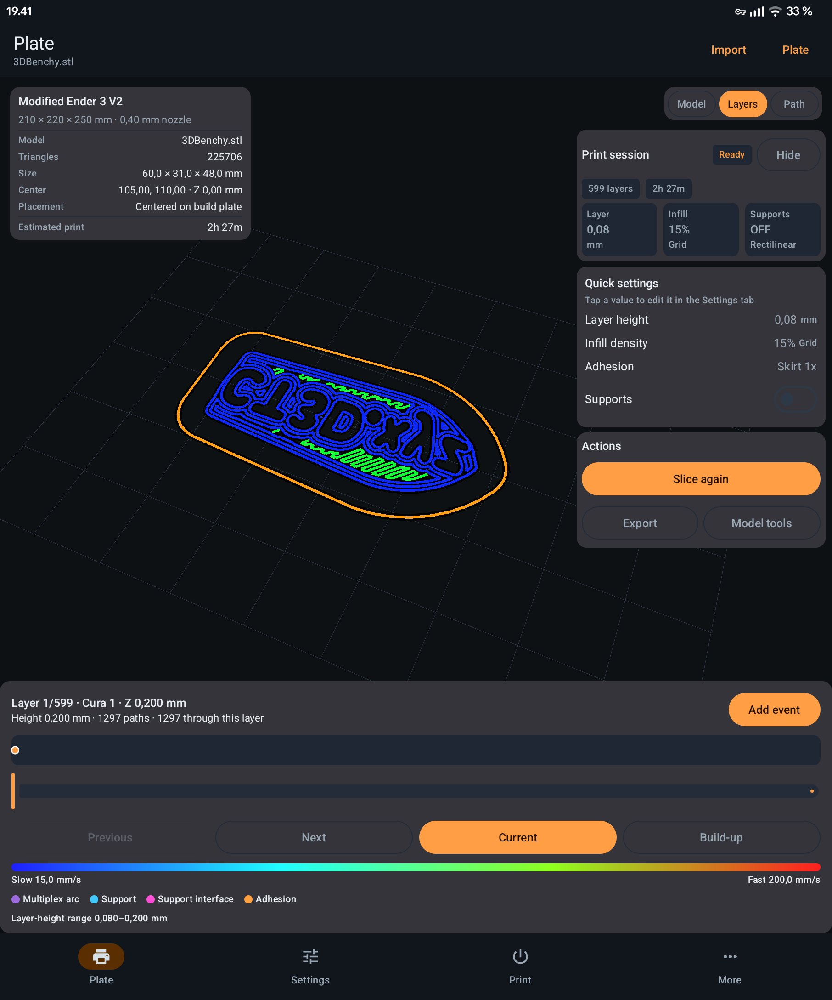
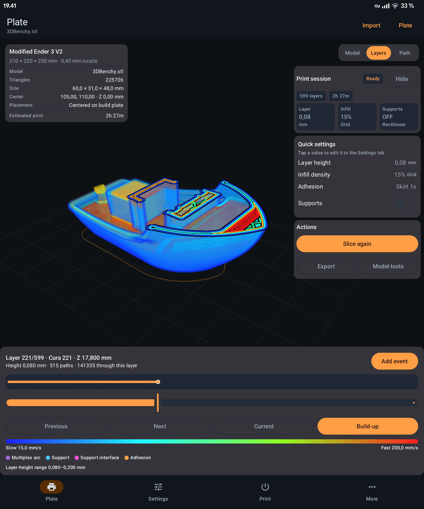
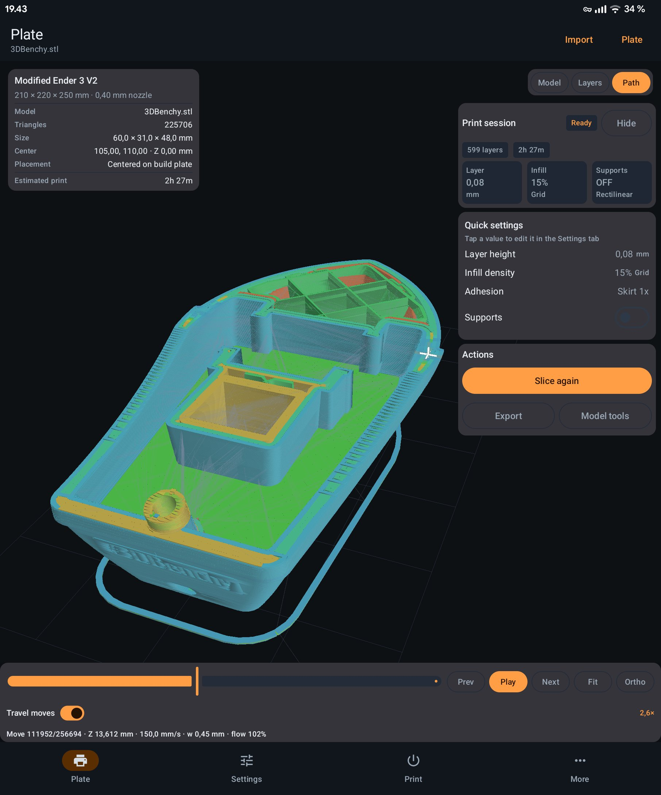
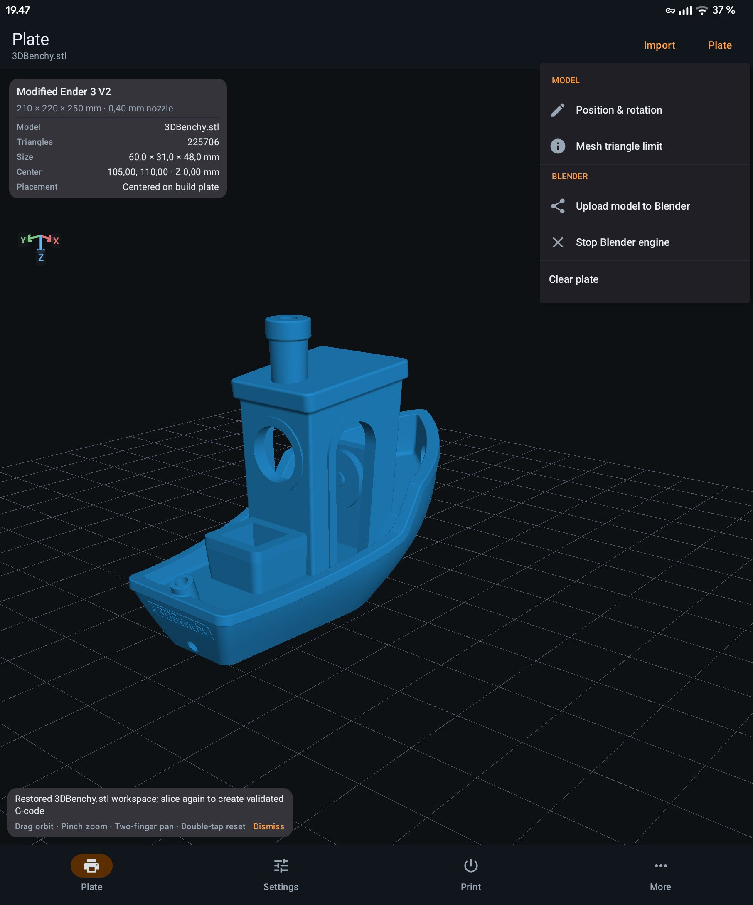

<p align="center">
  
</p>

# DuoSlicer

DuoSlicer (formerly EnderSlicerCura) is an Android-first front end for **both CuraEngine and PrusaSlicer** - importing, preparing, slicing, previewing and sending 3D prints from a phone or foldable. It is **1.0.0**, targets Android 10+ on **ARM64**, and bundles the CuraEngine ARM64 binary with Cura resources from **5.14.0-alpha.0** plus a native **PrusaSlicer 3.0.0-alpha11** engine with its resources. Its most-tested baseline is a modified Creality Ender 3 V2.

> This is development software, not a complete Cura or PrusaSlicer replacement. Inspect every model, setting and generated G-code before printing.

## Engines

- **Cura (blue)** - CuraEngine **5.14.0-alpha.0** (arm64-v8a) with Cura profiles, quality/material/adhesion/supports settings and Cura project (`.3mf`) or profile (`.curaprofile`) import
- **PrusaSlicer (orange)** - PrusaSlicer **3.0.0-alpha11** (arm64-v8a) with Prusa settings, marker-driven previews and settings import from a PrusaSlicer config bundle (`.ini`)
- One switcher in **Settings**; the app theme and accent (blue vs orange) follow the active engine, and per-engine profiles stay separate
- Both engines are cross-compiled for Android from their pinned sources and validated on device: importing a model, slicing it and exporting G-code works on either engine, and both previews parse their G-code dialects

## Screenshots

<p align="center">
  
  
  
  <br>
  <em>Plate &middot; print settings &middot; OctoPrint setup</em>
</p>

<p align="center">
  
  
  
  <br>
  <em>Layer preview (first layer, mid print) &middot; nozzle path</em>
</p>

## Importing

The simplest way to reproduce your Cura setup is to save a **project** from Cura Desktop (**File → Save Project…**, a `.3mf`) and import it with **Menu → Import Cura project (.3mf)**. A project bundles the machine definition, quality/material settings and start/end G-code in one file, so DuoSlicer can resolve the same formulas and values Cura uses.

For just the print/filament settings, export a **profile** (**File → Save Profile…**, a `.curaprofile`) and use **Menu → Import Cura profile**. A profile may not include machine definitions; the app then falls back to its bundled Ender 3 V2 definitions.

On the Prusa engine, use **Import settings from PrusaSlicer (.ini)** to apply a config bundle; machine and filament profiles are resolved the same way.

Imported values are kept as a persistent baseline: they stay in effect until you override them in the app, and app overrides are tracked separately. Formula resolution is verified against the pinned **5.14.0-alpha.0** resources; projects from other Cura versions usually import, but verify the resolved settings before a critical print.

## Features

### Slicing & profiles

- Local ARM64 slicing: CuraEngine with up to eight workers, plus the PrusaSlicer engine
- STL import plus Cura `.3mf` / `.curaprofile` import with machine/extruder inheritance and formula recalculation, and PrusaSlicer `.ini` config-bundle import
- Editable printer, quality, material, supports, travel, cooling and adhesion settings, per engine
- Adaptive layers (layer heights step 0.01 mm between 0.14 and 0.26 mm against a 0.2 mm base in shipped G-code), estimated time and repaired G-code metadata; validated CRLF `.gcode` export

### Automatic mesh leveling (AML)

- Exports the mriscoc AML sequence instead of a full-bed probe: `C29 L.. R.. F.. B.. X.. Y..` (mesh inset and grid), then `G29 P1` and `M420 S1`
- Grid density (3-9 points per axis, default 6) and inset margin (default 5 mm) are per-printer settings; the mesh covers the model footprint, so leveling takes seconds instead of minutes
- Off by default; needs a printer running mriscoc Ender 3 V2 / S1 Professional firmware with AML2.0 (2026 or later)

### Model, viewer & texturing

- Move, rotate, **scale by percentage**, center, lay flat and drop-to-bed; build-volume validation before slicing
- OpenGL model viewer, layer preview and **nozzle-path view with speed-colored beads** (cyan slow → orange fast - the one color mode on both engines)
- Offline BumpMesh displacement texturing (planar/triplanar/cubic or cylindrical mapping, 100k–8M triangle limit)

### Blender MCP engine

- Blender 3.6 runs in-process in the app (`libblender_exec.so`, arm64-v8a) in background mode with an MCP socket (default port `9876`), so an AI assistant can model and hand an STL straight to the slicer
- The first run materializes `assets/blender/{python,scripts}` into app storage; new `.stl` files in the export directory are picked up and shown as the latest model
- The packaged engine is trimmed: DWARF stripped and the GPU-kernel, virtualenv and numpy-test payload removed, with the Cycles CPU path and the MCP addon intact
- Protocol, runbook and verification evidence: [`BLENDER_MCP_INTEGRATION.md`](BLENDER_MCP_INTEGRATION.md)
- **Plate ▸ Blender ▸ Upload model to Blender** copies the loaded model into the engine's import directory so it can be opened and modified there; the result returns through the export handoff above. **Stop Blender engine** ends the engine and its keeper service deliberately

<p align="center">
  
</p>

### AI assistant

- A floating chat on the **Plate** tab talks to a **DeepSeek harness** over a tailnet: ask about the model, paint a region to show what should change, or press **Build from image** to have a photograph turned into a printable STL
- Photo-to-3D runs on a remote GPU box with **Hunyuan3D-2mini at DMC 512³**, checks the mesh is watertight, and hands it back through the same export directory the Blender engine uses - so it arrives on the plate with no interaction
- **Stop** cancels the running turn *and* the work it started; the chat rebuilds itself after a rotation or a process restart instead of coming up empty
- Architecture, the harness protocol, the generation runbook and the power management: [`AI_ASSISTANT.md`](AI_ASSISTANT.md), with the assistant's own skill files published under [`docs/skills/`](docs/skills/)

### Print editing

- Non-destructive layer events — pause, filament change, temperature, fan, speed, flow, retraction, camera, message and guarded custom G-code — without re-slicing

### Smart Infill & build-process thermal FEA (filaSim)

- Fully offline filaSim workspace: load-dependent FEA, graded/binary infill optimization via Cura modifier volumes, and layer-by-layer build simulation with warp and reaction reports
- Strict on-device validation of solver identity, units, transforms and numerical ranges; models never leave the device
- Still experimental until validated across more models and physical prints

### Experimental overhangs

- Native arc-overhang (Multiplex) and wave-overhang paths with normal bridge/skin fallback; mutually exclusive and off by default
- Smart overhang strategy: classifies the positioned mesh before slicing and decides where arc fill and CurviSlicer layers apply automatically, including a safe combined mode when CurviSlicer is enabled

### OctoPrint

- Encrypted authorization, upload/select/print, file browser, monitoring, webcam and guarded printer controls. See [`docs/octoprint-integration.md`](docs/octoprint-integration.md).

## Current limitations

- Single printable model, single extruder; no duplicate/auto-arrange workflow or Cura plugins
- Smart Infill, thermal FEA, arc/wave overhangs and the smart overhang strategy need broader physical print validation
- High-density models and fine FEA grids may exceed the Android heap; thermal FEA lacks transient conduction and creep
- Non-planar slicing (CurviSlicer and conical) buffers the full transformed G-code in memory, so very large or very dense prints can exhaust the Android heap (see "Increasing the Java heap")
- OctoPrint needs broader real-server validation; printer-specific firmware commands must be checked against the installed firmware
- The PrusaSlicer engine is packaged for **arm64-v8a** only; the x86_64 build was dropped because the shipped ABI is what device validation covers
- Cura previews estimate bead widths from the extrusion delta (Cura G-code carries no width markers), so a previewed width can differ slightly from what the engine planned
- The AI assistant is a client to a DeepSeek harness you run yourself, and photo-to-3D additionally needs a GPU box; neither is bundled, and replies are read from a polling projection rather than streamed

## Increasing the Java heap

Non-planar slicing (CurviSlicer and conical) builds the transformed G-code in memory, so very large or very dense prints can exhaust Android's default 512 MB large-heap limit and fail with an out-of-memory error.

On a rooted device the per-app heap can be raised through `dalvik.vm.heapsize`. In a root shell:

```sh
su
resetprop dalvik.vm.heapsize 1024m
resetprop dalvik.vm.heapgrowthlimit 512m
```

To persist across reboots, add the same `resetprop` lines to a Magisk boot script at `/data/adb/service.d/heap.sh`, then restart Zygote (`su -c "stop; start"`) or reboot. Verify with `getprop dalvik.vm.heapsize`. Only use larger values (for example `1536m`) on devices with 8 GB or more of RAM.

## Build

Requirements: JDK 17, Android SDK 36 + NDK `28.2.13676358`, CMake `3.22.1` / `3.31.6`, Gradle `9.4.1`, Python 3, Node.js `22.18.0+`, stable Rust (`wasm32-unknown-unknown`) and `wasm-pack 0.15.0`.

From a clean checkout:

```bash
chmod +x scripts/fetch-cura-resources.sh scripts/build-curaengine-android.sh scripts/fetch-prusa-engine-android.sh
scripts/fetch-cura-resources.sh
scripts/fetch-prusa-engine-android.sh

export ANDROID_NDK_HOME="$ANDROID_HOME/ndk/28.2.13676358"
export APP_JNILIBS_DIR="$PWD/app/src/main/jniLibs"
scripts/build-curaengine-android.sh

gradle :app:verifyDebugApkContents
```

`fetch-prusa-engine-android.sh` downloads the newest successful `PrusaSlicer-3.0.0-alpha11-android-arm64-v8a` artifact of the [`prusa-engine-3`](.github/workflows/prusa-engine-3.yml) workflow, which cross-compiles the alpha11 console from source; set `PRUSA_ENGINE_DIR` to a directory containing `prusa-slicer` and `resources` to package a local build instead.

Gradle prepares the pinned offline BumpMesh and filaSim assets before `preBuild`; `verifyDebugApkContents` builds the debug APK and verifies the packaged ARM64 CuraEngine and PrusaSlicer engine. GitHub Actions builds the WASM engine, runs the unit/regression and definition audits, verifies packaged assets and uploads the APK.

## Safety

Generated G-code is checked for valid extrusion temperatures, machine bounds, metadata and filename formatting before export, and remote printing requires explicit confirmation. Smart Infill and thermal FEA are engineering aids, not certified analyses — validate loads, constraints, material data, print orientation and safety factors before relying on them. Always verify the printer condition, model placement, build volume, temperatures, filament, first layer and custom G-code; terminal commands can move axes, heat the printer, modify firmware state or stop a print.

## License

DuoSlicer is distributed under GNU AGPL-3.0-or-later because it links to CuraEngine. The embedded BumpMesh and filaSim source are retained under `AGPL-3.0-only`. See [`THIRD_PARTY_NOTICES.md`](THIRD_PARTY_NOTICES.md). UltiMaker, Cura and PrusaSlicer are trademarks of their respective owners; DuoSlicer is not an official UltiMaker, Creality, Prusa Research or CNC Kitchen application.
